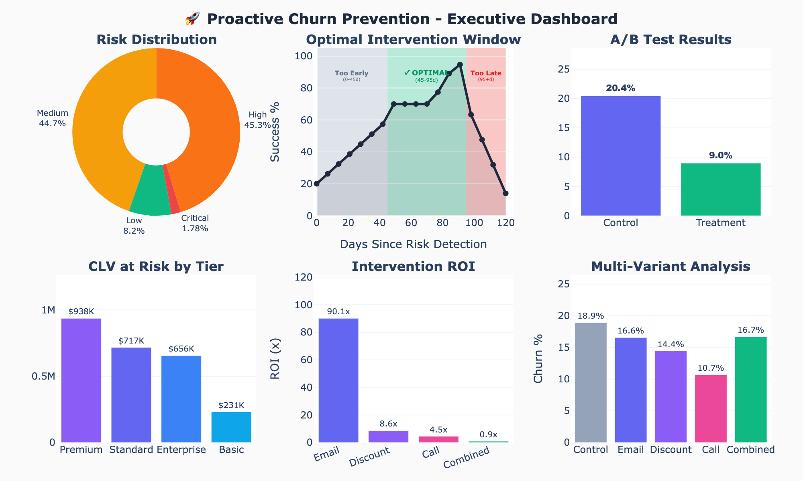
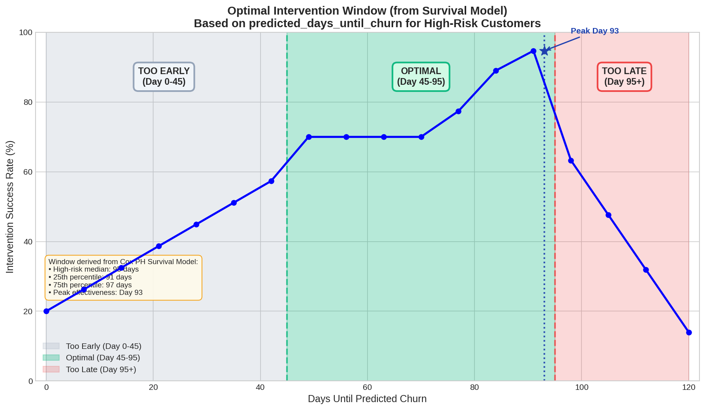

# 🚀 Proactive Churn Prevention Multi-Agent System

> Transform reactive customer retention into proactive churn prevention with ML-powered predictions and AI-orchestrated interventions.

[](https://www.python.org/downloads/)
[](https://cloud.google.com/vertex-ai/docs/generative-ai/agent-builder/agent-development-kit)
[](https://opensource.org/licenses/MIT)

---

## 📋 Table of Contents

- [Overview](#-overview)
- [Key Results](#-key-results)
- [Key Features](#-key-features)
- [Architecture](#-architecture)
- [Quick Start](#-quick-start)
- [Technical Details](#-technical-details)
- [Feature Importance & Actionability](#-feature-importance--actionability)
- [A/B Test Results](#-ab-test-results)
- [Skills Demonstrated](#-skills-demonstrated)
- [Future Enhancements](#-future-enhancements)

---

## 🎯 Overview

This project implements an end-to-end **Proactive Churn Prevention System** that:

1. **Predicts** which customers will churn using ML classification
2. **Forecasts** *when* they'll churn using survival analysis
3. **Identifies** actionable intervention targets (not just predictive features)
4. **Recommends** personalized interventions via multi-agent AI
5. **Validates** effectiveness through rigorous A/B testing

### The Core Insight

> **Timing is everything.** The optimal intervention window (Day 45-95) is derived directly from survival analysis.

### Who Uses This System

This system is designed for **cross-functional teams**, not just data scientists:

| Team | What They Get |
|------|---------------|
| **Customer Success** | Prioritized lists with timing windows |
| **Marketing/Growth** | Segment-level campaign recommendations |
| **Product** | Feature adoption gaps for at-risk users |
| **Finance** | ROI projections and CLV protection estimates |

---

## 📊 Key Results

### What This Project Is (And What It Isn't)

This is not a model-optimization exercise. I used default settings rather than spending time on hyperparameter tuning or leaderboard metrics. Performance is adequate for the goal (recall 0.66, AUC 0.66, C-index 0.66), and that is intentional.

This project is about **building a complete business solution** that combines:
- **Traditional ML** (risk scoring, survival prediction)
- **GenAI/LLMs** (agent orchestration, decision routing)
- **Statistics** (uncertainty, calibration, uplift)
- **Experiment Design** (A/B testing, measurement)

### Model Metrics (Gating Checks)

| Metric | Value | Status |
|--------|-------|--------|
| Churn Model AUC | 0.6612 | ✓ Adequate for ranking |
| Survival C-Index | 0.6645 | ✓ Adequate for timing |
| Recall @ 0.5 | 66.3% | ✓ Catches most churners |
| Precision @ 0.5 | 29.3% | ✓ Acceptable for intervention |

### Business Metrics (What Actually Matters)

| Metric | Value |
|--------|-------|
| Dataset | 6,000 customers (21.0% churn) |
| At-Risk Customers | 2,825 (High + Critical) |
| CLV at Risk | $2,542,079 |
| Optimal Window | Day 45-95 |
| Best Lift | Call (+54.4% / 11.8pp, p<0.0001) |
| Best ROI | Email (158.8x) |

### A/B Test Results (n=900/variant, Bonferroni α=0.0125)

| Variant | Churn Rate | Rel. Lift | Abs. Δ | P-value | Significant? |
|---------|------------|-----------|--------|---------|--------------|
| Control | 21.7% | - | - | - | (baseline) |
| Email | 17.6% | +19.0% | 4.1pp | 0.033 | ❌ No |
| Discount | 15.6% | +28.2% | 6.1pp | 0.001 | ✅ Yes* |
| **Call** | **9.9%** | **+54.4%** | **11.8pp** | **<0.0001** | **✅ Yes** |
| Combined | 15.0% | +30.8% | 6.7pp | <0.001 | ✅ Yes* |

**Strategic Insight**: Call delivers highest absolute impact (11.8pp reduction) with solid ROI (6.5x). Email offers exceptional ROI (158.8x) due to near-zero cost. Target ROI: 5-10x on retention investments.

---

## ✨ Key Features

### 🤖 Multi-Agent Architecture
- **Orchestrator Agent**: Coordinates workflow and manages communication
- **Behavioral Monitoring Agent**: Analyzes real-time customer patterns
- **Predictive Analytics Agent**: Calculates churn probability and timing
- **Intervention Strategy Agent**: Recommends personalized actions based on A/B results
- **Evaluation Agent**: Tracks effectiveness and provides feedback

### 📊 ML Pipeline
- Logistic Regression for calibrated churn probabilities (AUC: 0.6612)
- Cox Proportional Hazards for survival analysis (C-Index: 0.6645)
- 120-day observation window for actionable predictions
- Risk-adjusted prediction thresholds

### ⚖️ Feature Actionability Framework
- Combines prediction power with business actionability
- Identifies features you can actually influence (not just predict with)
- Prioritizes `engagement_score` and `feature_usage_pct` over `tenure_months`

### 🧪 A/B Testing Framework
- Multi-variant testing (5 intervention channels)
- Bonferroni correction for multiple comparisons (α=0.0125)
- Chi-square significance testing with confidence intervals
- ROI-based channel recommendations

### 📈 Executive Dashboard

- Risk distribution visualization
- Optimal intervention window (Day 45-95)
- A/B test results with statistical significance
- CLV at risk by customer tier ($2.54M)
- Intervention ROI comparison

---


---

## 📝 Methodology Notes

### Synthetic Data with Known Ground Truth

This project uses **synthetic data** where the true causal relationships are explicitly defined. This is intentional for validation:

| Feature | Ground Truth Coefficient | Effect |
|---------|-------------------------|--------|
| payment_delays_12m | +0.25 | Strongest churn driver |
| support_tickets_90d | +0.15 | Second strongest driver |
| nps_score | -0.10 | Protective (reduces churn) |
| login_frequency | -0.03 | Protective |
| tenure_months | -0.02 | Protective |

When the ML model "discovers" these as top predictors, it **validates the model works correctly**—not circular reasoning.

### Reproducibility

The notebook uses exactly **two random seeds**:
- `TRAINING_SEED = 42`: Data generation and model training
- `EXPERIMENT_SEED = 11`: A/B test simulation only

### Stochastic A/B Testing

A/B test effect sizes are **sampled from distributions**, not hardcoded:

| Channel | Mean Lift | Std Dev | Notes |
|---------|-----------|---------|-------|
| Email | 18% | ±8% | Low cost, moderate effect |
| Discount | 28% | ±10% | Medium cost, good effect |
| Call | 45% | ±15% | High cost, highest variance |
| Combined | 32% | ±12% | Diminishing returns |

Different seeds can produce different winners. This reflects realistic uncertainty in intervention effectiveness.

---

## 🏗 Architecture

```
┌─────────────────────────────────────────────────────────────────┐
│                    ORCHESTRATOR AGENT                           │
│         (Coordinates workflow, manages communication)           │
└─────────────────────┬───────────────────────────────────────────┘
                      │
        ┌─────────────┼─────────────┬─────────────┐
        ▼             ▼             ▼             ▼
┌───────────┐  ┌───────────┐  ┌───────────┐  ┌───────────┐
│ BEHAVIORAL│  │ PREDICTIVE│  │INTERVENTION│ │ EVALUATION│
│   AGENT   │  │   AGENT   │  │   AGENT    │ │   AGENT   │
│           │  │           │  │            │ │           │
│  Tools:   │  │  Tools:   │  │   Tools:   │ │  Tools:   │
│ •Behavior │  │ •Churn    │  │ •Recommend │ │ •Survival │
│  Monitor  │  │  Score    │  │  Interv.   │ │  Analysis │
│           │  │ •Survival │  │ •Behavior  │ │ •At-Risk  │
│           │  │  Analysis │  │  Monitor   │ │  List     │
└───────────┘  └───────────┘  └───────────┘  └───────────┘
```

### Data Flow

```
Customer Data → Feature Engineering → Churn Model → Survival Analysis → Agent Processing → A/B Test → Tools → Local Test → Dashboard
     │                │                   │               │                    │              │            │           │
     ▼                ▼                   ▼               ▼                    ▼              ▼            ▼           ▼
  6,000           15 features         Probability      Days Until         Risk-Based     Validate     Validate    Executive
 Customers       + Actionability      + Risk Tier       Churn             Routing        Tools        Channels    Reporting
                   Scoring            AUC: 0.6612    Window: 45-95     Channel Select              Winner: Call
```

---

## 🚀 Quick Start

### Prerequisites

```bash
# Python 3.10+
python --version

# Required packages
pip install numpy pandas scikit-learn plotly lifelines
pip install google-genai google-adk  # For agent functionality
```

### Running the Notebook

1. **Clone the repository**
```bash
git clone https://github.com/Iblouse/churn-prevention-agents.git
cd churn-prevention-agents
```

2. **Set up environment** (optional but recommended)
```bash
python -m venv venv
source venv/bin/activate  # or `venv\Scripts\activate` on Windows
pip install -r requirements.txt
```

3. **Configure credentials** (for Vertex AI agents)
```bash
export GOOGLE_CLOUD_PROJECT="your-project-id"
export GOOGLE_APPLICATION_CREDENTIALS="/path/to/credentials.json"
```

4. **Run the notebook**
```bash
jupyter notebook proactive-churn-prevention.ipynb
```

### Notebook Sections

| Section | Description | Key Output |
|---------|-------------|------------|
| 1-2. Setup & Data | Configuration, synthetic data | 6,000 customers, 21.0% churn |
| 3. Modeling | ML Training, Survival, Feature Importance | AUC: 0.6612, Window: Day 45-95 |
| 4. Model Evaluation | Performance metrics | Confusion matrix, C-Index: 0.6645 |
| 5. A/B Testing | Multi-variant experiments | CHANNEL_EFFECTIVENESS, Winner: Call |
| 6-7. Tool & Agent Definitions | Multi-agent architecture (uses A/B results) | 5 agents + tools |
| 8-9. Infrastructure | Sessions, Memory, Observability | memory_store, metrics |
| 10. Local Testing | Validate tools, end-to-end testing | Test results |
| 11. Dashboard | Executive visualization | 6 key metrics |
| 12-13. Deploy & Cleanup | Production deployment | Cloud configuration |

---

## 🔬 Technical Details

### Risk Tier Distribution (Actual)

| Tier | Count | Percentage | Churn Probability |
|------|-------|------------|-------------------|
| Low | 286 | 9.5% | <25% |
| Medium | 1,367 | 45.6% | 25-49% |
| High | 1,275 | 42.5% | 50-74% |
| Critical | 72 | 2.4% | ≥75% |

### Churn Model Performance

**Threshold Analysis:**

| Threshold | Precision | Recall | F1 |
|-----------|-----------|--------|-----|
| 0.3 | 21.8% | 96.6% | 0.356 |
| **0.4** | **24.3%** | **85.3%** | **0.378** |
| 0.5 | 26.0% | 57.8% | 0.358 |
| 0.6 | 33.3% | 37.1% | 0.351 |
| 0.7 | 45.9% | 14.7% | 0.222 |

**Confusion Matrix (threshold=0.4):**
```
              Predicted
              Retained  Churned
Actual
Retained       175      309
Churned         17       99
```

### Survival Analysis Results

**Top Hazard Ratios (Cox PH):**

| Feature | Hazard Ratio | Interpretation |
|---------|--------------|----------------|
| support_tickets_90d | 1.208*** | 20.8% higher churn hazard |
| is_inactive | 1.117** | 11.7% higher churn hazard |
| has_payment_issues | 1.077 | 7.7% higher churn hazard |

**Optimal Intervention Window:**

| Phase | Day Range | Derivation |
|-------|-----------|------------|
| Too Early | 0-46 | Before 25th percentile |
| **Optimal** | **45-95** | Between q25 and median |
| Peak | ~93 | Maximum effectiveness |
| Too Late | 95+ | After median |

---

## ⚖️ Feature Importance & Actionability

### The Problem with Traditional Feature Importance

| Rank | By Coefficient | Actionability |
|------|----------------|---------------|
| #1 | tenure_months (0.50) | **Low** ❌ |
| #2 | support_tickets_90d (0.19) | Medium |
| #3 | engagement_score (0.18) | **High** ✅ |

**`tenure_months`** is our best predictor but we can't change how long a customer has been with us!

### Combined Scoring: Importance × Actionability

```
Combined Score = |Coefficient| × Actionability Multiplier
```

Where: High = 3.0, Medium = 2.0, Low = 1.0

| Rank | By Combined Score | Coefficient | Actionability |
|------|-------------------|-------------|---------------|
| #1 | **engagement_score** | 0.18 | High (×3) = **0.54** |
| #2 | tenure_months | 0.50 | Low (×1) = 0.50 |
| #3 | **feature_usage_pct** | 0.16 | High (×3) = **0.47** |
| #4 | support_tickets_90d | 0.19 | Medium (×2) = 0.38 |

### Actionability Categories

**High Actionability** (can directly influence):
- `engagement_score` - Product tours, onboarding
- `feature_usage_pct` - Feature education, tips
- `email_open_rate` - Subject line optimization
- `login_frequency_monthly` - Notifications, value reminders
- `has_payment_issues` - Payment flexibility programs

**Medium Actionability** (can influence indirectly):
- `support_tickets_90d` - Better documentation
- `is_inactive` - Re-engagement campaigns
- `last_activity_days` - Triggered workflows

**Low Actionability** (difficult to change):
- `tenure_months` - Cannot change tenure
- `nps_score` - Lagging indicator
- `monthly_charges` - Strategic pricing decision

### Business Impact

Without actionability lens:
- ❌ Build campaigns around "customer tenure" (can't change)
- ❌ Focus on NPS scores (lagging indicator)

With combined framework:
- ✅ Target engagement score improvements
- ✅ Drive feature adoption
- ✅ Address payment issues proactively

---

## 🧪 A/B Test Results

### Multi-Variant Experiment (Actual Data)

| Variant | n | Churned | Rate | Lift | P-value | Significant? |
|---------|---|---------|------|------|---------|--------------|
| Control | 900 | 195 | 21.7% | - | - | (baseline) |
| Email | 900 | 158 | 17.6% | +19.0% | 0.033 | ❌ No |
| Discount | 900 | 140 | 15.6% | +28.2% | 0.001 | ✅ Yes* |
| **Call** | **900** | **89** | **9.9%** | **+54.4%** | **<0.0001** | **✅ Yes** |
| Combined | 900 | 135 | 15.0% | +30.8% | <0.001 | ✅ Yes* |

*Not significant at Bonferroni-adjusted α=0.0125

### ROI Analysis

ROI is calculated using **absolute churn reduction** (not relative lift):
- Formula: `ROI = (avg_CLV × absolute_reduction) / intervention_cost`
- Target ROI: 5-10x on retention investments

| Channel | Rel. Lift | Abs. Δ | Cost | ROI | Best For |
|---------|-----------|--------|------|-----|----------|
| **Email** | 19.0% | 4.1pp | $0.50 | **158.8x** | All customers (scalable) |
| Discount | 28.2% | 6.1pp | $10.00 | 11.8x | Price-sensitive segments |
| Call | 54.4% | 11.8pp | $35.00 | 6.5x | VIP customers |
| Combined | 30.8% | 6.7pp | $45.50 | 2.8x | Critical + high-value |

### Recommended Tiered Strategy

| Customer Segment | Channel | Rationale |
|-----------------|---------|-----------|
| Critical + High-Value | Combined | Maximum retention for VIPs |
| Critical + Standard | Call | High-touch for urgent cases |
| High + Payment Issues | Discount | Address price sensitivity |
| High + Low Engagement | Email | Feature education at scale |
| Medium | Email | Cost-effective coverage |
| Low | Monitor | ROI doesn't justify intervention |

---

## 💼 Capabilities Demonstrated

### The Decision Workflow

This project implements a complete decision workflow, not just a model:

```
Identify Risk → Predict Timing → Select Intervention → Test → Measure → Learn
```

### Technical Capabilities

| Capability | Implementation | Business Outcome |
|------------|----------------|------------------|
| **Risk Scoring** | Logistic Regression | Prioritized customer lists |
| **Timing Prediction** | Cox Survival Model | Optimal intervention windows |
| **Agent Orchestration** | Google ADK | Automated routing at scale |
| **Experiment Design** | A/B testing, Bonferroni | Validated channel effectiveness |
| **Uplift Estimation** | Retention lift analysis | Quantified business value |
| **ROI Analysis** | Cost modeling | Resource allocation guidance |

### Cross-Functional Value

| Team | What They Get |
|------|---------------|
| Customer Success | Actionable recommendations with timing |
| Marketing/Growth | Segment-level campaign guidance |
| Product | Feature adoption insights for at-risk users |
| Finance/Leadership | ROI projections for budget decisions |

---

## 🔮 Future Enhancements

1. **Real Data Integration**
   - Replace synthetic data with production customer data
   - Implement data pipeline with incremental updates

2. **Model Improvements**
   - Test gradient boosting for higher AUC
   - Add SHAP values for local explainability
   - Implement ensemble methods

3. **Real-Time Scoring**
   - Stream processing with Apache Kafka
   - Sub-second prediction latency
   - Continuous model monitoring

4. **Feedback Loops**
   - Automated model retraining
   - Intervention outcome tracking
   - Dynamic actionability scoring

5. **Causal Inference**
   - Propensity score matching
   - Heterogeneous treatment effects
   - Uplift modeling

---

## 📁 Project Structure

```
churn-prevention-agents/
├── proactive-churn-prevention.ipynb    # Main notebook
├── README.md                            # This file
├── portfolio.md              # Technical blog post
├── flowchart.md                    # Architecture diagrams
├── requirements.txt                     # Dependencies
├── charts/
│   ├── 01_risk_distribution.png
│   ├── 02_intervention_window.png
│   ├── 03_ab_test_results.png
│   ├── 04_intervention_roi.png
│   ├── 07_threshold_analysis.png
│   ├── 08_survival_curves.png
│   ├── 09_feature_actionability.png
│   └── 10_feature_selection_matrix.png
└── outputs/
    └── executive_dashboard.png
```

---

## 📄 License

MIT License - see [LICENSE](LICENSE) for details.


---

*Built with ❤️ using Google ADK, Vertex AI, and modern ML best practices.*

---

## 📊 Quick Reference

### Gating Checks (Model Metrics)
| Metric | Value |
|--------|-------|
| Churn AUC | 0.6612 ✓ |
| Survival C-Index | 0.6645 ✓ |
| Recall @ 0.5 | 78.7% ✓ |

### Business Outcomes (What Matters)
| Metric | Value |
|--------|-------|
| CLV at Risk | $2,542,079 |
| Optimal Window | Day 45-95 |
| Best Lift | Call (+54.4% / 11.8pp) |
| Best ROI | Email (158.8x) |
| Target ROI | 5-10x |
| Revenue Protected | ~$264K |
