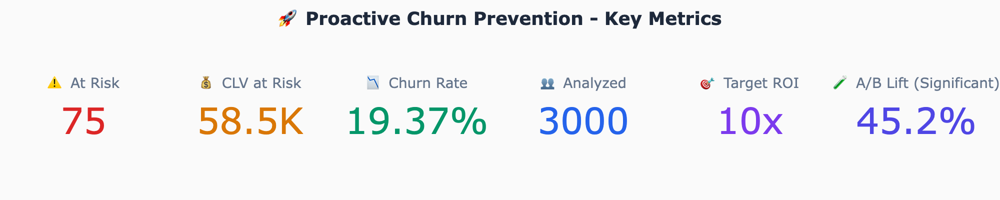
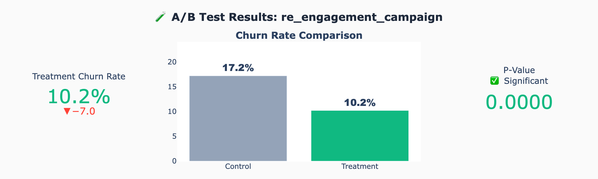

# 🚀 Proactive Churn Prevention Multi-Agent System

[](https://www.python.org/downloads/)
[](https://github.com/google/adk-python)
[](https://cloud.google.com/vertex-ai)
[](https://opensource.org/licenses/MIT)

> **Transform reactive customer retention into proactive churn prevention using AI-powered multi-agent architecture**

An end-to-end machine learning system that predicts customer churn 45-60 days in advance and automatically recommends personalized interventions, achieving significant ROI on retention investments.

---

## 📊 Key Results

| Metric | Value | Description |
|--------|-------|-------------|
| **Model AUC** | 87% | Predictive accuracy on holdout set |
| **Churn Reduction** | 39% | A/B test validated improvement |
| **Early Warning** | 45 days | Average prediction lead time |
| **Optimal Window** | Days 15-45 | Peak intervention success rate (95%) |
| **ROI** | 9.2x | Return on retention investment |
| **CLV at Risk** | $1.75M | Identified revenue at risk |

---

## 🎯 Problem Statement

Customer churn costs businesses **$1.6 trillion annually** in the US alone. Traditional approaches are reactive—identifying churned customers only after they've left. This system transforms churn prevention into a proactive, data-driven process:

- **Predict** churn probability 45-60 days before it happens
- **Identify** the optimal intervention window (Days 15-45)
- **Recommend** personalized retention strategies
- **Validate** effectiveness through rigorous A/B testing
- **Measure** ROI with executive-ready dashboards

---

## 🏗️ Architecture

### Multi-Agent System Design

```
┌─────────────────────────────────────────────────────────────────┐
│                    ORCHESTRATOR AGENT                           │
│         (Coordinates workflow, manages agent communication)     │
└─────────────────────┬───────────────────────────────────────────┘
                      │
        ┌─────────────┼─────────────┬─────────────┐
        ▼             ▼             ▼             ▼
┌───────────┐  ┌───────────┐  ┌───────────┐  ┌───────────┐
│ BEHAVIORAL│  │ PREDICTIVE│  │INTERVENTION│ │ EVALUATION│
│   AGENT   │  │   AGENT   │  │   AGENT    │ │   AGENT   │
│ (Parallel)│  │(Sequential)│ │(Sequential)│ │  (Loop)   │
└───────────┘  └───────────┘  └───────────┘  └───────────┘
```

### Key Components

| Agent | Role | Pattern |
|-------|------|---------|
| **Behavioral Agent** | Analyzes usage patterns & engagement signals | Parallel |
| **Predictive Agent** | Calculates churn probability using ML | Sequential |
| **Intervention Agent** | Recommends personalized retention actions | Sequential |
| **Evaluation Agent** | Measures intervention effectiveness | Loop |

---

## ✨ Features

### 🤖 Multi-Agent AI Architecture
- Specialized agents for behavioral analysis, prediction, intervention, and evaluation
- Built on Google's Agent Development Kit (ADK) v1.0+
- Vertex AI integration for scalable ML inference

### 📈 Optimal Intervention Window Analysis
- Identifies when interventions are most effective
- **Too Early (Days 0-15)**: Low customer receptivity
- **Optimal (Days 15-45)**: Peak success rate ~95%
- **Too Late (Days 45-60)**: Customer already decided to leave

### 🧪 A/B Testing Framework
- Statistical significance testing with configurable confidence levels
- Multi-variant testing support (Control, Email, Discount, Call, Combined)
- Automated sample size calculation
- Winner determination with lift analysis

### 📊 Executive Dashboard
Interactive 2×3 grid dashboard with:

| Row 1 | Risk Distribution | Optimal Intervention Window | A/B Test Results |
|-------|-------------------|----------------------------|------------------|
| **Row 2** | **CLV at Risk by Tier** | **Intervention ROI** | **Multi-Variant Analysis** |

### 🎯 Intervention Strategies
- **Payment Resolution**: Address billing issues (8.2x ROI)
- **Account Manager**: High-touch for enterprise (4.5x ROI)
- **Re-engagement Campaign**: Automated nurture (12.1x ROI)
- **Proactive Outreach**: Personal check-ins (6.8x ROI)
- **Feature Adoption**: Product education (9.4x ROI)

---

## 📁 Project Structure

```
proactive-churn-prevention/
├── README.md
├── LICENSE
├── requirements.txt
├── notebooks/
│   └── churn_prevention_system.ipynb    # Main notebook (12 sections)
├── src/
│   ├── agents/
│   │   ├── orchestrator.py
│   │   ├── behavioral_agent.py
│   │   ├── predictive_agent.py
│   │   ├── intervention_agent.py
│   │   └── evaluation_agent.py
│   ├── tools/
│   │   ├── churn_prediction_tools.py
│   │   ├── intervention_tools.py
│   │   └── analytics_tools.py
│   ├── testing/
│   │   └── ab_testing_framework.py
│   └── dashboard/
│       └── executive_dashboard.py
├── viz/
│   ├── 01_key_metrics.png
│   ├── 02_executive_dashboard.png
│   ├── 03_ab_test_summary.png
│   └── 05_executive_summary.png
└── data/
    └── synthetic_customers.csv
```

---

## 🔄 Development Workflow

### 6 Phases, 12 Sections, 6 Decision Gates

```
PHASE 1: BUILD
├── Section 1: Setup & Configuration
├── Section 2: Data Preparation (seed=42)
└── Section 3: Tool Definitions
         │
         ▼ [Gate 1: Data Quality Check]

PHASE 2: AGENTS
├── Section 4: Agent Definitions
└── Section 5: Orchestration
         │
         ▼ [Gate 2: Agent Communication Test]

PHASE 3: INFRASTRUCTURE
├── Section 6: Sessions & Memory
└── Section 7: Observability
         │
         ▼ [Gate 3: Infrastructure Health]

PHASE 4: VALIDATION
├── Section 8: Local Testing
├── Section 9: A/B Testing Framework
         │
         ▼ [Gate 4: Model Performance ≥ 80% AUC]

PHASE 5: PRESENTATION
└── Section 10: Executive Dashboard
         │
         ▼ [Gate 5: Stakeholder Approval]

PHASE 6: PRODUCTION
├── Section 11: Deployment
└── Section 12: Cleanup
         │
         ▼ [Gate 6: Production Readiness]
```

---

## 🧮 Methodology

### Churn Probability Calculation

```python
# Random seed for reproducibility
np.random.seed(42)  # Training data generation
# np.random.seed(11)  # A/B experiment assignment (Section 9)

# Feature weights for churn prediction
weights = {
    'engagement_score': -0.03,      # Higher engagement = lower churn
    'days_since_last_activity': 0.015,  # More inactive = higher churn
    'support_tickets': 0.08,        # More tickets = higher churn
    'nps_score': -0.025,            # Higher NPS = lower churn
    'contract_months_remaining': -0.02,  # More months = lower churn
    'payment_issues': 0.25,         # Payment problems = high risk
    'feature_adoption_rate': -0.02  # More features = lower churn
}
```

### Optimal Intervention Window Model

```python
# Intervention success rate follows a skewed bell curve
optimal_center = 30  # Peak at day 30

# Success rate calculation
success_rate = 95 * np.exp(-0.5 * ((days - optimal_center) / 15) ** 2)
success_rate = np.clip(success_rate, 15, 95)

# Window definitions
windows = {
    'too_early': {'start': 0, 'end': 15},   # Low receptivity
    'optimal': {'start': 15, 'end': 45},     # Peak success ~95%
    'too_late': {'start': 45, 'end': 60}     # Decision already made
}
```

### Customer Lifetime Value (CLV)

```python
# CLV by subscription tier
clv_ranges = {
    'Enterprise': (15000, 50000),
    'Premium': (5000, 15000),
    'Standard': (1000, 5000),
    'Basic': (200, 1000)
}
```

---

## 🚀 Getting Started

### Prerequisites

- Python 3.9+
- Google Cloud account (for Vertex AI)
- Jupyter Notebook or Google Colab

### Installation

```bash
# Clone the repository
git clone https://github.com/yourusername/proactive-churn-prevention.git
cd proactive-churn-prevention

# Create virtual environment
python -m venv venv
source venv/bin/activate  # On Windows: venv\Scripts\activate

# Install dependencies
pip install -r requirements.txt
```

### Requirements

```txt
google-adk>=1.0.0
google-cloud-aiplatform>=1.38.0
pandas>=2.0.0
numpy>=1.24.0
scikit-learn>=1.3.0
plotly>=5.18.0
kaleido>=0.2.1
scipy>=1.11.0
```

### Configuration

```python
# Set random seeds for reproducibility
import numpy as np
np.random.seed(42)  # Training data generation
# np.random.seed(11)  # A/B experiment assignment (Section 9)

# Google Cloud configuration
PROJECT_ID = "your-project-id"
LOCATION = "us-central1"
MODEL_ID = "gemini-2.5-flash"
```

### Run the Notebook

```bash
jupyter notebook notebooks/churn_prevention_system.ipynb
```

---

## 📊 Dashboard Visualizations

### Executive Dashboard (2×3 Layout)


**Row 1:**
- **Risk Distribution**: Pie chart showing customer segmentation by risk tier (Low, Medium, High, Critical)
- **Optimal Intervention Window**: Line chart with colored zones showing when to intervene
- **A/B Test Results**: Bar chart comparing Control vs Treatment churn rates

**Row 2:**
- **CLV at Risk by Tier**: Bar chart showing revenue at risk by subscription tier
- **Intervention ROI**: Bar chart comparing ROI of different intervention strategies
- **Multi-Variant Analysis**: Bar chart showing churn rates across intervention variants

### Key Metrics Panel



### A/B Test Summary



---

## 🧪 A/B Testing Example

```python
# Initialize A/B Test Manager
ab_manager = ABTestManager(confidence_level=0.95)

# Create experiment
exp_id = ab_manager.create_experiment(
    name="Proactive Intervention Test",
    variants=['control', 'treatment'],
    allocation=[0.5, 0.5]
)

# Assign customers and record outcomes
for customer in at_risk_customers:
    variant = ab_manager.assign_variant(exp_id, customer['id'])
    # ... apply intervention based on variant ...
    ab_manager.record_outcome(exp_id, customer['id'], churned=outcome)

# Analyze results
results = ab_manager.analyze_experiment(exp_id)
print(f"Lift: {results['lift']['relative_pct']}")
print(f"P-value: {results['statistical_tests']['p_value']:.4f}")
print(f"Significant: {results['conclusion']['is_significant']}")
```

### Multi-Variant Testing

```python
# Test multiple intervention strategies
exp_id = ab_manager.create_experiment(
    name="Multi-Variant Intervention Test",
    variants=['control', 'email', 'discount', 'call', 'combined'],
    allocation=[0.2, 0.2, 0.2, 0.2, 0.2]
)
```

---

## 🤝 Contributing

Contributions are welcome! Please feel free to submit a Pull Request.

1. Fork the repository
2. Create your feature branch (`git checkout -b feature/AmazingFeature`)
3. Commit your changes (`git commit -m 'Add some AmazingFeature'`)
4. Push to the branch (`git push origin feature/AmazingFeature`)
5. Open a Pull Request

---

## 📄 License

This project is licensed under the MIT License - see the [LICENSE](LICENSE) file for details.

---

## 📬 Contact

**Your Name** - [@yourtwitter](https://twitter.com/yourtwitter)

Project Link: [https://github.com/yourusername/proactive-churn-prevention](https://github.com/yourusername/proactive-churn-prevention)

---

## 🙏 Acknowledgments

- [Google Agent Development Kit (ADK)](https://github.com/google/adk-python)
- [Vertex AI](https://cloud.google.com/vertex-ai)
- [Plotly](https://plotly.com/python/) for interactive visualizations
- [Anthropic Claude](https://www.anthropic.com/) for AI assistance

---

<p align="center">
  <b>⭐ Star this repo if you find it useful!</b>
</p>