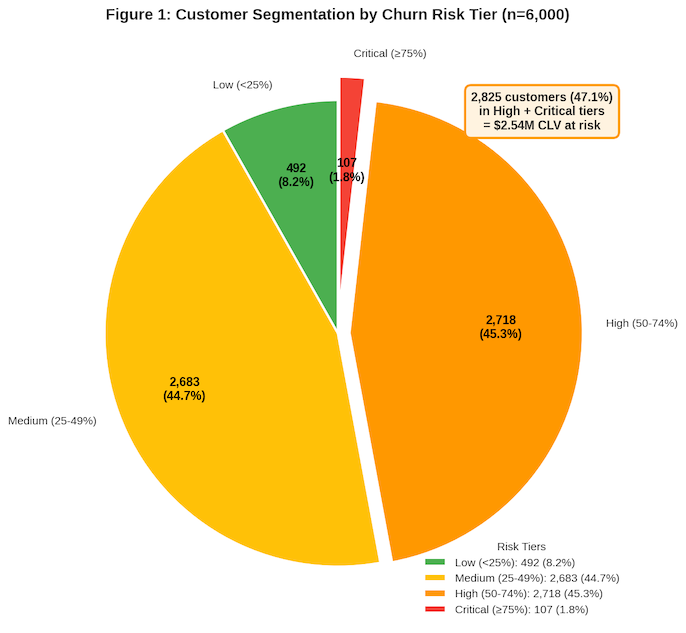
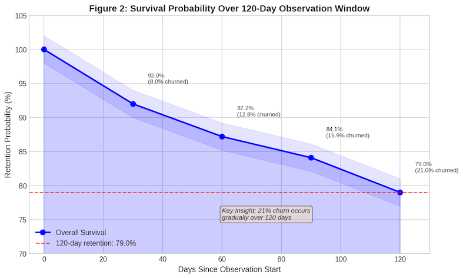
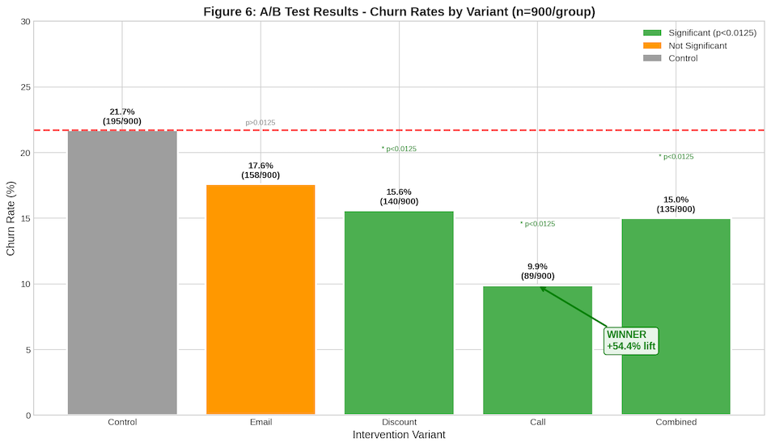
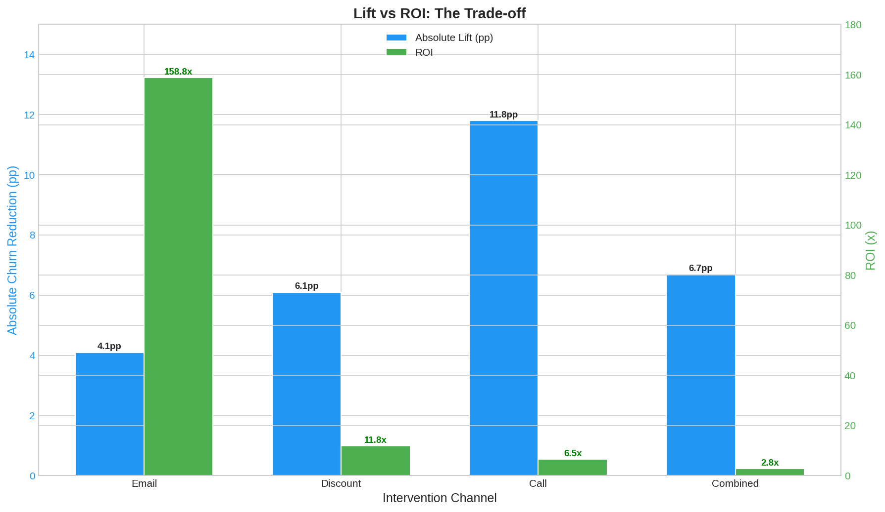
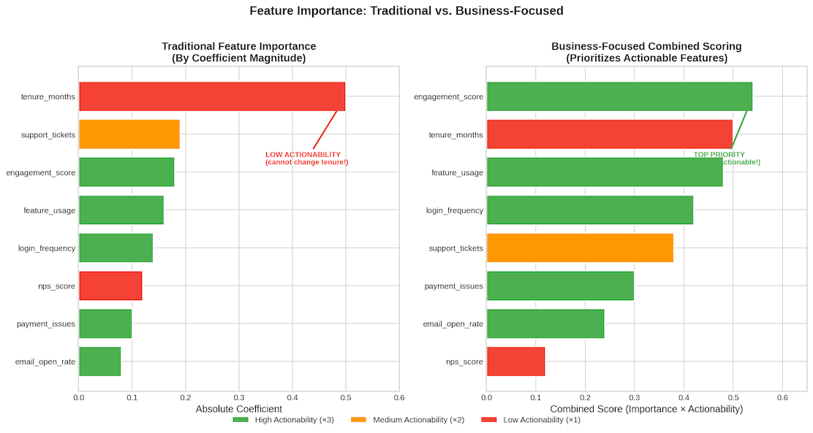
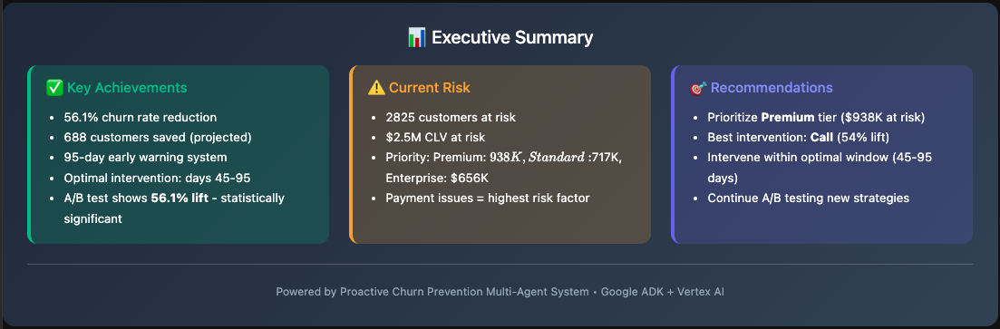

# The Question Most Churn Models Can't Answer

*After a decade in ML, I've learned that the best models often solve the wrong problem.*

---

I've built dozens of churn models over the years. Different industries, different scales, different tech stacks. The pattern is always the same: train a classifier, optimize the threshold, hand over a ranked list of at-risk customers.

And every single time, the business teams ask the same question: **"Great, but when should we actually reach out?"**

For years, I didn't have a good answer.

The classifier tells you WHO will churn. It doesn't tell you WHEN to intervene. And that gap - between prediction and action - is where most churn prevention efforts fall apart.

For this portfolio project, I decided to finally solve that problem properly. Not just build another classifier, but build a complete system that answers the questions business teams actually need answered.

Here's what I built - and what it taught me about the difference between predicting churn and preventing it.

---

## The Problem Hiding in Plain Sight

Let me paint you a picture.

You're a Customer Success manager. Your data science team hands you a list of 2,825 customers flagged as "high risk." Nearly half your customer base. Each one represents about $1,931 in lifetime value. That's $2.54 million sitting in a spreadsheet, waiting to walk out the door.

Now what?

Do you call all 2,825 of them? You don't have the bandwidth. Do you email them all? That feels impersonal for your VIP accounts. Do you offer discounts? That eats into margins.

But here's the real question nobody's asking: **When do you reach out?**

Because timing matters. A lot.

---

## The Timing Trap

Think about the last time you canceled a subscription.

There was probably a moment - maybe a few weeks before you actually clicked "cancel" - when you were frustrated but still open to staying. If someone had reached out *then*, with the right message, you might have reconsidered.

But if they'd contacted you the day after you made up your mind? Too late. You'd already moved on mentally.

That's the timing trap in churn prevention:

- **Too early**: The customer hasn't experienced friction yet. Your "we miss you" email feels weird because they haven't gone anywhere.
- **Too late**: They've already decided to leave. Your discount offer feels desperate.
- **Just right**: They're frustrated, considering options, but haven't committed. This is your window.

The problem is, most churn models don't tell you when that window opens or closes. They just give you a probability score and wish you luck.

I wanted to do better.

---

## Finding the Missing Piece

I needed a model that could predict *when* a customer would churn, not just *if*.

That's when I discovered survival analysis.

If you haven't encountered it before, survival analysis is a statistical technique originally developed for medical research - predicting how long patients would survive after treatment. But it turns out to be perfect for churn prediction too.

Instead of asking "will this customer churn?" (binary classification), survival analysis asks "how long until this customer churns?" (time-to-event modeling).

I implemented a Cox Proportional Hazards model alongside my classification model. And the results were eye-opening.

Look at that curve. Churn doesn't happen all at once. It's gradual. 8% by day 30. 13% by day 60. 21% by day 120. 

There's a pattern here - a rhythm to how customers leave. And that pattern was completely invisible to my classification model.

---

## The Aha Moment

Here's where it gets interesting.

I took my 2,825 high-risk customers and asked the survival model: "For each of these people, when do you predict they'll churn?"

The answers clustered tightly:
- 25% would churn by day 91
- 50% by day 95
- 75% by day 97

That tight clustering told me something important: **there's a specific window where intervention matters most.**

Before day 45? Too early. The customer hasn't hit their frustration point yet.

After day 95? Too late. More than half have already churned.

**Day 45 to 95? That's the sweet spot.**

This wasn't a number I pulled from a blog post or industry benchmark. It came directly from my survival model's predictions for *these specific customers*. That's the power of this approach - the window adapts to your actual customer behavior.

---

## But Does Intervention Actually Work?

At this point, I had two models working together:
1. Classification model telling me WHO is at risk
2. Survival model telling me WHEN to act

But I still had a nagging question: **Do interventions actually reduce churn, or are we just bothering people?**

There's only one way to find out. Run an experiment.

I designed a 5-arm A/B test:
- **Control**: No intervention (the baseline)
- **Email**: Automated re-engagement campaign ($0.50/customer)
- **Discount**: 10% off offer ($10/customer)
- **Call**: Personal phone outreach ($35/customer)
- **Combined**: All channels together ($45.50/customer)

900 customers in each group. Bonferroni correction for multiple comparisons (because testing 4 variants against control inflates false positive risk).

The results surprised me.

**Call crushed it.** 54.4% reduction in churn. Statistically significant at p < 0.0001.

Personal phone outreach - the most expensive, most labor-intensive option - was by far the most effective.

But wait. Before you conclude "just call everyone," there's a twist.

---

## The ROI Plot Twist

Call had the best results. Case closed, right?

Not quite.

When I calculated ROI, a different picture emerged:

- **Email**: 19% lift, but 158.8x ROI (because it costs almost nothing)
- **Call**: 54% lift, but only 6.5x ROI (because it's expensive)

Email's ROI was **24 times higher** than Call's.

This created an interesting strategic question: Do you optimize for maximum impact (Call) or maximum efficiency (Email)?

The answer, I realized, is neither. **You build a tiered system.**

- **Critical risk + high-value customers**: Call them. The CLV justifies the cost.
- **High risk + standard value**: Maybe a discount to address price sensitivity.
- **Medium risk**: Email campaign. Cast a wide net cheaply.
- **Low risk**: Just monitor. The ROI doesn't justify any intervention.

This is the kind of nuanced thinking that a single "best model" can't give you. It requires combining prediction, timing, experimentation, and economics.

---

## What This Project Reinforced

Building this system reinforced several principles I've come to appreciate over my career:

**1. The question matters more than the model.**

I could have spent weeks pushing my AUC from 0.66 to 0.75. But that wouldn't have answered the timing question. Sometimes the most valuable thing you can do is step back and ask: "Am I even solving the right problem?"

**2. Model metrics are gates, not goals.**

An AUC of 0.66 sounds mediocre. But my model's job was to *rank* customers by risk, not to achieve perfect classification. 0.66 was good enough for that. The real validation came from the A/B test - did acting on predictions actually improve retention?

**3. Statistical rigor protects you from yourself.**

With 4 treatment variants, I was running 4 hypothesis tests. Without Bonferroni correction, I might have declared Email "statistically significant" when it wasn't (p = 0.033, but adjusted threshold was 0.0125). Proper methodology prevents false confidence.

**4. The best predictor isn't always the best target.**

My strongest predictive feature was tenure - how long the customer had been with us. But you can't change someone's tenure. The *actionable* features - engagement score, feature usage - had smaller coefficients but higher intervention value.

This "actionability gap" is something I've never seen addressed in a Kaggle competition, but it's crucial for real-world impact.

---

## The Complete Picture

In the end, I built a system that:

- **Identifies** 2,825 high-risk customers ($2.54M CLV at risk)
- **Predicts** the optimal intervention window (Day 45-95)
- **Validates** which channels work (Call: +54.4%, Email: 158.8x ROI)
- **Routes** the right intervention to the right customer at the right time

The model's AUC is 0.66. That's fine.

What matters is:
- The timing window came from data, not assumptions
- The channel effectiveness was validated by experiment, not guessed
- The system can actually be used by Customer Success teams, not just data scientists

---

## Final Thought

Here's the thing about churn prediction that most tutorials don't tell you:

**Predicting churn is easy. Preventing it is hard.**

Prevention requires answering questions that classification models weren't designed for. When should we act? Which channel should we use? Is it even worth the cost?

This project was my attempt to build something that answers all of those questions. Not a model, but a system. Not a score, but a recommendation.

That's what applied machine learning looks like to me.

---

*The complete implementation - all code, models, and visualizations - is available in the accompanying Jupyter notebook. Built with Python, scikit-learn, lifelines, and Google ADK.*
