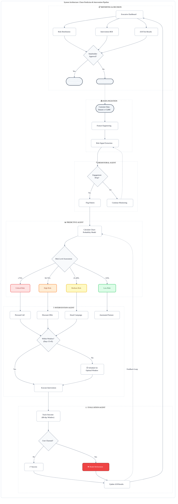

```mermaid
%%{init: {
  'theme': 'base',
  'themeVariables': {
    'primaryColor': '#ffffff',
    'primaryTextColor': '#0f172a',
    'primaryBorderColor': '#94a3b8',
    'lineColor': '#64748b',
    'fontFamily': 'Arial, sans-serif',
    'fontSize': '14px'
  },
  'flowchart': {
    'curve': 'basis',
    'padding': 20
  }
}}%%

flowchart TD
    %% Global Styling Classes
    classDef default fill:#ffffff,stroke:#94a3b8,stroke-width:1px,rx:8,ry:8,color:#0f172a,shadow:false;
    classDef decision fill:#f8fafc,stroke:#64748b,stroke-width:1px,rx:5,ry:5,shape:rhombus;
    classDef endpoint fill:#f1f5f9,stroke:#334155,stroke-width:2px,rx:5,ry:5;
    classDef critical fill:#fee2e2,stroke:#ef4444,stroke-width:2px,color:#991b1b;
    classDef high fill:#ffedd5,stroke:#f97316,stroke-width:2px,color:#9a3412;
    classDef medium fill:#fef9c3,stroke:#eab308,stroke-width:2px,color:#854d0e;
    classDef low fill:#dcfce7,stroke:#22c55e,stroke-width:2px,color:#166534;
    classDef deploy fill:#10b981,stroke:#047857,stroke-width:2px,color:#ffffff;
    classDef refine fill:#ef4444,stroke:#991b1b,stroke-width:2px,color:#ffffff;

    subgraph CONTAINER ["System Architecture: Churn Prediction & Intervention Pipeline"]
        direction TB

        subgraph INPUT ["📥 DATA INGESTION"]
            direction TB
            A(["Customer Data<br/>Dataset: n=3,000"]) --> B[Feature Engineering]
            B --> C[Risk Signal Extraction]
        end

        subgraph BEHAVIORAL ["🔍 BEHAVIORAL AGENT"]
            direction TB
            C --> D{"Engagement<br/>Drop?"}
            D -->|Yes| E[🚩 Flag Pattern]
            D -->|No| F[Continue Monitoring]
            F -.-> C
        end

        subgraph PREDICTIVE ["📊 PREDICTIVE AGENT"]
            direction TB
            E --> G[Calculate Churn<br/>Probability Model]
            G --> H{"Risk Level Assessment"}
            H -->|≥75%| I[Critical Risk]
            H -->|50-74%| J[High Risk]
            H -->|25-49%| K[Medium Risk]
            H -->|<25%| L[Low Risk]
        end

        subgraph INTERVENTION ["💡 INTERVENTION AGENT"]
            direction TB
            I --> M[Personal Call]
            J --> N[Discount Offer]
            K --> O[Email Campaign]
            L --> P[Automated Nurture]
            
            %% Fixed syntax here by adding quotes around label with parentheses
            M & N & O --> Q{"Within Window?<br/>(Days 15-45)"}
            Q -->|Yes| R[🚀 Execute Intervention]
            Q -->|No| S["🕒 Schedule for<br/>Optimal Window"]
            S --> R
        end

        subgraph EVALUATION ["📈 EVALUATION AGENT"]
            direction TB
            R --> T["Track Outcome<br/>(60-day Window)"]
            T --> U{"User Churned?"}
            U -->|No| V[✅ Success]
            U -->|Yes| W[❌ Model Refinement]
            V & W --> X[Update A/B Results]
            X -. Feedback Loop .-> G
        end

        subgraph OUTPUT ["📋 REPORTING & DECISION"]
            direction TB
            X --> Z[Executive Dashboard]
            Z --> AA[Risk Distribution]
            Z --> AB[Intervention ROI]
            Z --> AC[A/B Test Results]
            
            AA & AB & AC --> AD{"Stakeholder<br/>Approval?"}
            AD -->|Yes| AE([🚀 DEPLOY TO<br/>PRODUCTION])
            AD -->|No| AF([Review & Iterate])
            AF -.-> A
        end
    end

    %% Apply Classes
    class D,H,Q,U,AD decision;
    class I critical;
    class J high;
    class K medium;
    class L low;
    class AE deploy;
    class AF,W refine;
    class A,AE,AF endpoint;

    %% Subgraph Styling for Clean White Look
    style CONTAINER fill:#ffffff,stroke:#e2e8f0,stroke-width:2px,rx:10,ry:10
    style INPUT fill:#ffffff,stroke:#cbd5e1,stroke-width:1px,stroke-dasharray: 5 5
    style BEHAVIORAL fill:#ffffff,stroke:#cbd5e1,stroke-width:1px,stroke-dasharray: 5 5
    style PREDICTIVE fill:#ffffff,stroke:#cbd5e1,stroke-width:1px,stroke-dasharray: 5 5
    style INTERVENTION fill:#ffffff,stroke:#cbd5e1,stroke-width:1px,stroke-dasharray: 5 5
    style EVALUATION fill:#ffffff,stroke:#cbd5e1,stroke-width:1px,stroke-dasharray: 5 5
    style OUTPUT fill:#ffffff,stroke:#cbd5e1,stroke-width:1px,stroke-dasharray: 5 5

```