# Proactive Churn Prevention System - Workflow Diagram

This flowchart matches the actual notebook execution order (Sections 1-13).

```mermaid
graph TD
    %% -- STYLING DEFINITIONS --
    classDef container fill:#ffffff,stroke:#333333,stroke-width:2px,color:#000000;
    classDef p1 fill:#e3f2fd,stroke:#1565c0,stroke-width:1px,color:#000;
    classDef p2 fill:#e8f5e9,stroke:#2e7d32,stroke-width:1px,color:#000;
    classDef p3 fill:#f3e5f5,stroke:#7b1fa2,stroke-width:1px,color:#000;
    classDef p4 fill:#fff3e0,stroke:#ef6c00,stroke-width:1px,color:#000;
    classDef p5 fill:#ffebee,stroke:#c62828,stroke-width:1px,color:#000;
    classDef p6 fill:#eceff1,stroke:#455a64,stroke-width:1px,color:#000;

    %% Main Container
    subgraph Main_System [Proactive Churn Prevention System]
        direction TB

        %% --- Phase 1: Data Foundation (Blue) - Sections 1-2 ---
        Start([Section 1-2:<br/>Setup & Data]) --> P1[Generate Synthetic<br/>Customer Data<br/>n=6,000]
        P1 --> P2[Feature Engineering<br/>15 Features + CLV]
        P2 -->|customer_df| P3

        %% --- Phase 2: Modeling (Green) - Section 3 ---
        P3[Train Churn Model<br/>LogisticRegression] --> P4[Add churn_probability<br/>& risk_tier]
        P4 --> P5[Train Survival Model<br/>Cox PH]
        P5 --> P6[Calculate Optimal<br/>Window: Day 45-95]
        P6 --> P7[Feature Importance<br/>& Actionability]

        %% --- Phase 3: Evaluation (Purple) - Section 4 ---
        P7 --> P8[Model Evaluation<br/>AUC: 0.6612<br/>Threshold: 0.5]
        P8 --> D1{Metrics<br/>Adequate?}
        D1 -- No: Retrain --> P3
        D1 -- Yes --> P9

        %% --- Phase 4: Experimentation (Red) - Section 5 ---
        P9[A/B Test Simulation<br/>5 Variants x 900] --> P10[Statistical Analysis<br/>Chi-Square + Bonferroni]
        P10 --> P11[Calculate ROI<br/>per Channel]
        P11 --> D2{Significant<br/>Winner?}
        D2 -- No: Adjust --> P9
        D2 -- Yes: Call Wins --> P12

        %% --- Phase 5: Agent Construction (Orange) - Sections 6-9 ---
        P12[Define Tool Functions<br/>Using A/B Results] --> P13[Create AI Agents<br/>5 Specialized Agents]
        P13 --> P14[Configure Infrastructure<br/>Memory & Observability]

        %% --- Phase 6: Validation (Grey) - Section 10 ---
        P14 --> P15[Local Testing<br/>Validate All Tools]
        P15 --> D3{Tests<br/>Pass?}
        D3 -- No: Debug --> P12
        D3 -- Yes --> P16

        %% --- Phase 7: Output (Grey) - Sections 11-13 ---
        P16[Generate Executive<br/>Dashboard] --> D4{Stakeholder<br/>Approval?}
        D4 -- No: Refine --> P1
        D4 -- Yes --> P17[Package for<br/>Deployment]
        P17 --> End([Section 13:<br/>Cleanup & Deploy])
    end

    %% -- APPLYING CLASSES --
    class Main_System container;
    class Start,P1,P2 p1;
    class P3,P4,P5,P6,P7 p2;
    class P8,D1 p3;
    class P9,P10,P11,D2 p5;
    class P12,P13,P14 p4;
    class P15,D3,P16,D4,P17,End p6;
```



## Legend

| Color | Phase | Sections | Purpose |
|-------|-------|----------|---------|
| 🔵 Blue | Data Foundation | 1-2 | Setup, Data Generation, Feature Engineering |
| 🟢 Green | Modeling | 3 | ML Training, Survival Analysis, Feature Importance |
| 🟣 Purple | Evaluation | 4 | All metrics consolidated (AUC, thresholds, confusion matrix) |
| 🔴 Red | Experimentation | 5 | A/B Testing Framework (creates CHANNEL_EFFECTIVENESS) |
| 🟠 Orange | Agents | 6-9 | Tools (use A/B results), Agents, Memory, Observability |
| ⚪ Grey | Validation & Output | 10-13 | Local Testing, Dashboard, Deployment, Cleanup |

## Key Data Dependencies (Industry-Standard Flow)

```
Section 2: customer_df (6,000 customers, 21.0% churn)
    │
    ▼
Section 3: CHURN_MODEL (AUC: 0.6612), SURVIVAL_MODEL (C-Index: 0.6645)
    │
    ▼
Section 4: MODEL_METRICS (threshold: 0.5, F1: 0.406)
    │
    ▼
Section 5: CHANNEL_EFFECTIVENESS, INTERVENTION_ROI (A/B Testing)
           Winner: Call (+54.4% lift, 6.5x ROI)
    │
    ▼
Section 6: recommend_intervention() (uses A/B results)
    │
    ▼
Section 10: Local Testing (validates everything)
    │
    ▼
Section 11: Executive Dashboard (CLV at Risk: $2.54M)
```

## Section Structure

| Section | Name | Key Outputs |
|---------|------|-------------|
| 1 | Setup & Configuration | Environment, seeds, constants |
| 2 | Data Preparation | customer_df (6,000 rows) |
| 3 | Modeling | CHURN_MODEL, SURVIVAL_MODEL, Window: Day 45-95 |
| 4 | Model Evaluation | AUC: 0.6612, C-Index: 0.6645, Threshold: 0.5 |
| 5 | A/B Testing Framework | CHANNEL_EFFECTIVENESS, INTERVENTION_ROI |
| 6 | ADK Imports & Tool Definitions | Tool functions using A/B results |
| 7 | Agent Definitions | 5 specialized agents |
| 8 | Sessions & Memory | Session management |
| 9 | Observability | Logging, monitoring |
| 10 | Local Testing | Validation of all tools |
| 11 | Executive Dashboard | 6-panel visualization |
| 12 | Deployment | Production packaging |
| 13 | Cleanup | Resource cleanup |

## Why This Order Matters

**Industry Standard ML Workflow**:
```
1. Train models on training data
2. Evaluate on test data  
3. Experiment to validate interventions (A/B test)
4. Build tools that use experiment results
5. Test the complete system
6. Deploy to production
```

This ensures `recommend_intervention()` uses **validated A/B test results**, not assumptions.
