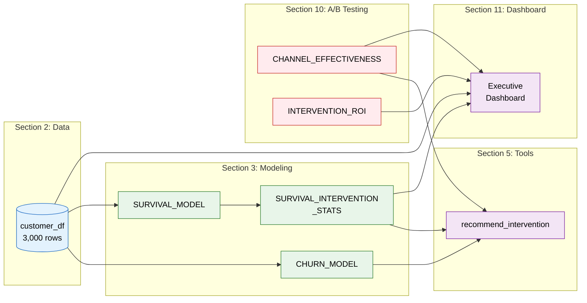
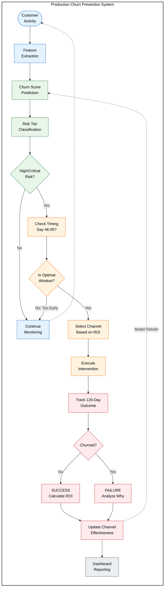
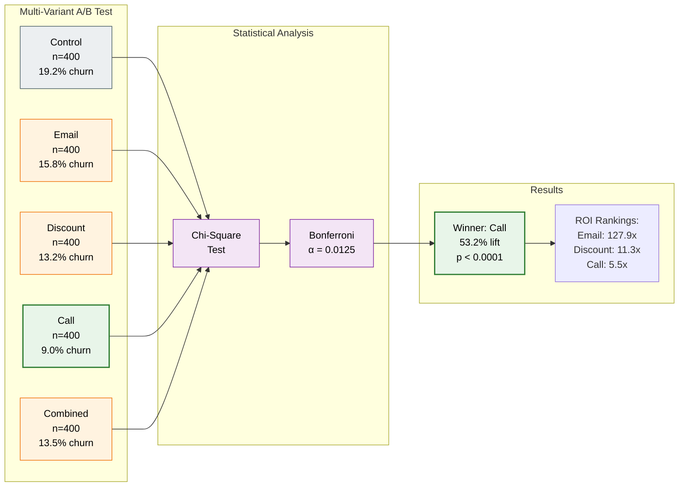
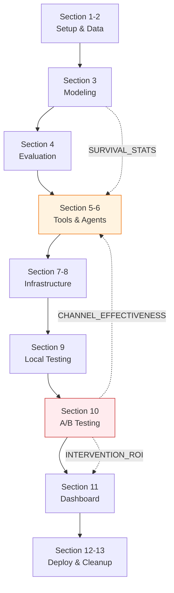

# Proactive Churn Prevention System - Workflow Diagrams

## Notebook Execution Flow

This flowchart matches the actual notebook execution order (Sections 1-13).

```mermaid
graph TD
    %% -- STYLING DEFINITIONS --
    classDef container fill:#ffffff,stroke:#333333,stroke-width:2px,color:#000000;
    classDef p1 fill:#e3f2fd,stroke:#1565c0,stroke-width:1px,color:#000;
    classDef p2 fill:#e8f5e9,stroke:#2e7d32,stroke-width:1px,color:#000;
    classDef p3 fill:#f3e5f5,stroke:#7b1fa2,stroke-width:1px,color:#000;
    classDef p4 fill:#fff3e0,stroke:#ef6c00,stroke-width:1px,color:#000;
    classDef p5 fill:#ffebee,stroke:#c62828,stroke-width:1px,color:#000;
    classDef p6 fill:#eceff1,stroke:#455a64,stroke-width:1px,color:#000;

    %% Main Container
    subgraph Main_System [Proactive Churn Prevention System - Notebook Flow]
        direction TB

        %% --- Phase 1: Data Foundation (Blue) - Sections 1-2 ---
        Start([Section 1-2:<br/>Setup & Data]) --> P1[Generate Synthetic<br/>Customer Data<br/>n=3,000]
        P1 --> P2[Feature Engineering<br/>15 Features + CLV]
        P2 -->|customer_df| P3

        %% --- Phase 2: Modeling (Green) - Section 3 ---
        P3[Train Churn Model<br/>LogisticRegression] --> P4[Add churn_probability<br/>& risk_tier]
        P4 --> P5[Train Survival Model<br/>Cox PH]
        P5 --> P6[Calculate Optimal<br/>Intervention Window<br/>Day 46-95]
        P6 --> P7[Feature Importance<br/>& Actionability]

        %% --- Phase 3: Evaluation (Purple) - Section 4 ---
        P7 --> P8[Model Evaluation<br/>AUC: 0.66, C-Index: 0.68]
        P8 --> D1{Metrics<br/>Adequate?}
        D1 -- No: Retrain --> P3
        D1 -- Yes --> P9

        %% --- Phase 4: Agent Construction (Orange) - Sections 5-6 ---
        P9[Define Tool Functions<br/>recommend_intervention] --> P10[Create AI Agents<br/>Orchestrator + 4 Specialists]
        P10 --> P11[Configure Infrastructure<br/>Memory & Observability]

        %% --- Phase 5: Validation (Red) - Sections 9-10 ---
        P11 --> P12[Local Testing<br/>Validate Tools]
        P12 --> D2{Tools<br/>Working?}
        D2 -- No: Debug --> P9
        D2 -- Yes --> P13

        P13[A/B Test Simulation<br/>5 Variants × 400 each] --> P14[Statistical Analysis<br/>Chi-Square + Bonferroni]
        P14 --> P15[Calculate ROI<br/>per Channel]
        P15 --> D3{Significant<br/>Results?}
        D3 -- No: Adjust --> P13
        D3 -- Yes --> P16

        %% --- Phase 6: Output (Grey) - Sections 11-13 ---
        P16[Generate Executive<br/>Dashboard<br/>6 Visualizations] --> D4{Stakeholder<br/>Approval?}
        D4 -- No: Refine --> P1
        D4 -- Yes --> P17[Package for<br/>Deployment]
        P17 --> End([Section 13:<br/>Cleanup & Deploy])
    end

    %% -- APPLYING CLASSES --
    class Main_System container;
    class Start,P1,P2 p1;
    class P3,P4,P5,P6,P7 p2;
    class P8,D1 p3;
    class P9,P10,P11 p4;
    class P12,D2,P13,P14,P15,D3 p5;
    class P16,D4,P17,End p6;
```

## Key Data Dependencies

## Production System Flow (Conceptual)

This shows how the trained system would operate in production (not in the notebook).

## A/B Testing Analysis Flow

## Section Dependencies

