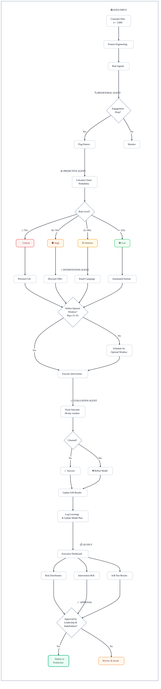

```mermaid
%%{init: {
  "theme": "base",
  "flowchart": { "curve": "basis", "nodeSpacing": 52, "rankSpacing": 70, "padding": 14 },
  "themeVariables": {
    "background": "#ffffff",
    "fontFamily": "Inter, Arial, sans-serif",
    "fontSize": "16px",
    "lineColor": "#1f2937",
    "textColor": "#0f172a",
    "primaryColor": "#ffffff",
    "primaryTextColor": "#0f172a",
    "primaryBorderColor": "#cbd5e1",
    "clusterBkg": "transparent",
    "clusterBorder": "transparent"
  }
}}%%
flowchart TB

  subgraph FRAME[" "]
    direction TB

    subgraph INPUT["📥 DATA INPUT"]
      direction TB
      A["Customer Data<br/>n = 3,000"] --> B["Feature Engineering"]
      B --> C["Risk Signals"]
    end

    subgraph BEHAVIORAL["🔍 BEHAVIORAL AGENT"]
      direction TB
      C --> D{"Engagement<br/>Drop?"}
      D -->|Yes| E["Flag Pattern"]
      D -->|No| F["Monitor"]
    end

    subgraph PREDICTIVE["📊 PREDICTIVE AGENT"]
      direction TB
      E --> G["Calculate Churn<br/>Probability"]
      G --> H{"Risk Level?"}
      H -->|≥ 75%| I["🔴 Critical"]
      H -->|50–74%| J["🟠 High"]
      H -->|25–49%| K["🟡 Medium"]
      H -->|< 25%| L["🟢 Low"]
    end

    subgraph INTERVENTION["💡 INTERVENTION AGENT"]
      direction TB
      I --> M["Personal Call"]
      J --> N["Discount Offer"]
      K --> O["Email Campaign"]
      L --> P["Automated Nurture"]

      M --> Q{"Within Optimal<br/>Window?<br/>Days 15–45"}
      N --> Q
      O --> Q
      P --> Q

      Q -->|Yes| R["Execute Intervention"]
      Q -->|No| S["Schedule for<br/>Optimal Window"]
      S --> R
    end

    subgraph EVALUATION["📈 EVALUATION AGENT"]
      direction TB
      R --> T["Track Outcome<br/>60-day window"]
      T --> U{"Churned?"}
      U -->|No| V["✅ Success"]
      U -->|Yes| W["❌ Refine Model"]
      V --> X["Update A/B Results"]
      W --> X
      X --> Y["Log Learnings<br/>& Update Model Plan"]
    end

    subgraph OUTPUT["📋 OUTPUT"]
      direction TB
      Y --> Z["Executive Dashboard"]
      Z --> AA["Risk Distribution"]
      Z --> AB["Intervention ROI"]
      Z --> AC["A/B Test Results"]
    end

    subgraph DECISION["✅ APPROVAL"]
      direction TB
      AA --> AD{"Approved by<br/>Leadership &<br/>Stakeholders?"}
      AB --> AD
      AC --> AD
      AD -->|Yes| AE["🚀 Deploy to<br/>Production"]
      AD -->|No| AF["Review & Iterate"]
    end
  end

  %% -------------------- STYLES --------------------
  classDef node fill:#ffffff,stroke:#cbd5e1,stroke-width:2px,color:#0f172a,rx:10,ry:10;
  classDef decision fill:#ffffff,stroke:#94a3b8,stroke-width:2px,color:#0f172a;
  classDef success fill:#ecfdf5,stroke:#10b981,stroke-width:3px,color:#064e3b,rx:12,ry:12;
  classDef warning fill:#fff7ed,stroke:#fb923c,stroke-width:2px,color:#7c2d12,rx:12,ry:12;
  classDef riskCritical fill:#fef2f2,stroke:#ef4444,stroke-width:2px,color:#7f1d1d,rx:12,ry:12;
  classDef riskHigh fill:#fff7ed,stroke:#fb923c,stroke-width:2px,color:#7c2d12,rx:12,ry:12;
  classDef riskMed fill:#fffbeb,stroke:#f59e0b,stroke-width:2px,color:#78350f,rx:12,ry:12;
  classDef riskLow fill:#f0fdf4,stroke:#22c55e,stroke-width:2px,color:#14532d,rx:12,ry:12;

  class A,B,C,E,F,G,M,N,O,P,R,T,X,Y,Z,AA,AB,AC node;
  class D,H,Q,U,AD decision;
  class AE success;
  class AF warning;
  class I riskCritical;
  class J riskHigh;
  class K riskMed;
  class L riskLow;

  %% Single continuous outer rectangle
  style FRAME fill:#ffffff,stroke:#94a3b8,stroke-width:2px,color:#0f172a

  %% Hide inner subgraph borders so the frame reads as one continuous rectangle
  style INPUT fill:transparent,stroke:transparent,color:#0f172a
  style BEHAVIORAL fill:transparent,stroke:transparent,color:#0f172a
  style PREDICTIVE fill:transparent,stroke:transparent,color:#0f172a
  style INTERVENTION fill:transparent,stroke:transparent,color:#0f172a
  style EVALUATION fill:transparent,stroke:transparent,color:#0f172a
  style OUTPUT fill:transparent,stroke:transparent,color:#0f172a
  style DECISION fill:transparent,stroke:transparent,color:#0f172a

  linkStyle default stroke:#1f2937,stroke-width:2px


```