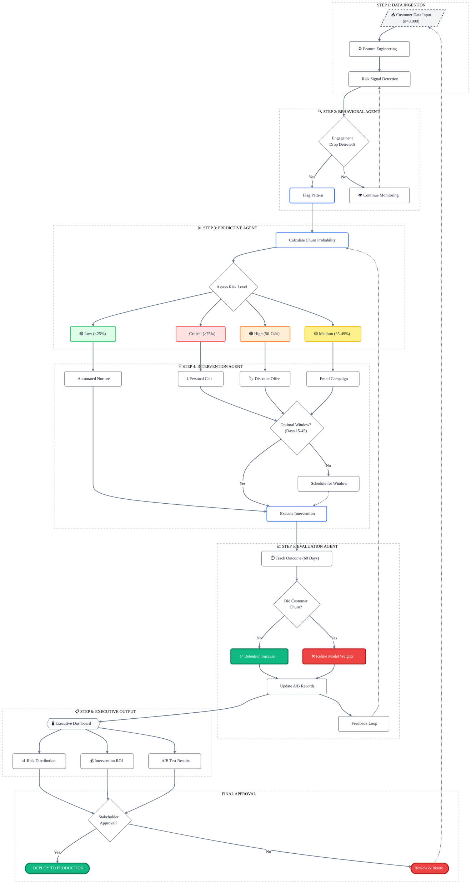

```mermaid
%%{init: {
  'theme': 'base',
  'themeVariables': {
    'primaryColor': '#ffffff',
    'primaryTextColor': '#1f2937',
    'primaryBorderColor': '#1f2937',
    'lineColor': '#4b5563',
    'fontSize': '14px',
    'fontFamily': 'Helvetica, Arial, sans-serif'
  }
}}%%

flowchart TD
    %% --- GLOBAL STYLING ---
    classDef default fill:#fff,stroke:#374151,stroke-width:1px,rx:5,ry:5,color:#1f2937;
    classDef inputNode fill:#f3f4f6,stroke:#374151,stroke-width:2px,stroke-dasharray: 5 5;
    classDef agentNode fill:#fff,stroke:#2563eb,stroke-width:2px;
    classDef decisionNode fill:#fff,stroke:#374151,stroke-width:1px,shape:rhombus;
    classDef criticalNode fill:#fee2e2,stroke:#ef4444,stroke-width:2px;
    classDef highNode fill:#ffedd5,stroke:#f97316,stroke-width:2px;
    classDef medNode fill:#fef08a,stroke:#eab308,stroke-width:2px;
    classDef lowNode fill:#dcfce7,stroke:#22c55e,stroke-width:2px;
    classDef successNode fill:#10b981,stroke:#047857,stroke-width:3px,color:#fff;
    classDef failNode fill:#ef4444,stroke:#b91c1c,stroke-width:3px,color:#fff;
    classDef dashboardNode fill:#f8fafc,stroke:#64748b,stroke-width:1px,shape:rect;

    %% --- 1. DATA INGESTION ---
    subgraph INPUT ["📂 STEP 1: DATA INGESTION"]
        direction TB
        A[/"📥 Customer Data Input<br/>(n=3,000)"/]:::inputNode
        B["⚙️ Feature Engineering"]
        C["📡 Risk Signal Detection"]
        
        A --> B --> C
    end

    %% --- 2. BEHAVIORAL ANALYSIS ---
    subgraph BEHAVIORAL ["🔍 STEP 2: BEHAVIORAL AGENT"]
        direction TB
        D{"Engagement<br/>Drop Detected?"}:::decisionNode
        E["🚩 Flag Pattern"]:::agentNode
        F["👁️ Continue Monitoring"]
        
        C --> D
        D -->|Yes| E
        D -->|No| F
        F -.-> C
    end

    %% --- 3. PREDICTIVE MODELING ---
    subgraph PREDICTIVE ["📊 STEP 3: PREDICTIVE AGENT"]
        direction TB
        G["🧮 Calculate Churn Probability"]:::agentNode
        H{"Assess Risk Level"}:::decisionNode
        
        I["🔴 Critical (≥75%)"]:::criticalNode
        J["🟠 High (50-74%)"]:::highNode
        K["🟡 Medium (25-49%)"]:::medNode
        L["🟢 Low (<25%)"]:::lowNode

        E --> G --> H
        H --> I
        H --> J
        H --> K
        H --> L
    end

    %% --- 4. INTERVENTION STRATEGY ---
    subgraph INTERVENTION ["💡 STEP 4: INTERVENTION AGENT"]
        direction TB
        M["📞 Personal Call"]
        N["🏷️ Discount Offer"]
        O["📧 Email Campaign"]
        P["🤖 Automated Nurture"]
        
        Q{"Optimal Window?<br/>(Days 15-45)"}:::decisionNode
        R["🚀 Execute Intervention"]:::agentNode
        S["📅 Schedule for Window"]
        
        I --> M
        J --> N
        K --> O
        L --> P

        M & N & O --> Q
        P --> R
        
        Q -->|Yes| R
        Q -->|No| S
        S -.-> R
    end

    %% --- 5. EVALUATION LOOP ---
    subgraph EVALUATION ["📈 STEP 5: EVALUATION AGENT"]
        direction TB
        T["⏱️ Track Outcome (60 Days)"]
        U{"Did Customer<br/>Churn?"}:::decisionNode
        V["✅ Retention Success"]:::successNode
        W["❌ Refine Model Weights"]:::failNode
        X["📝 Update A/B Records"]
        Y["🔄 Feedback Loop"]
        
        R --> T --> U
        U -->|No| V
        U -->|Yes| W
        V & W --> X --> Y
        Y -.-> G
    end

    %% --- 6. OUTPUT & DASHBOARD ---
    subgraph OUTPUT ["📋 STEP 6: EXECUTIVE OUTPUT"]
        direction TB
        Z{{"🖥️ Executive Dashboard"}}:::dashboardNode
        AA["📊 Risk Distribution"]
        AB["💰 Intervention ROI"]
        AC["🧪 A/B Test Results"]
        
        X --> Z
        Z --> AA & AB & AC
    end

    %% --- 7. FINAL DECISION ---
    subgraph DECISION ["🏁 FINAL APPROVAL"]
        direction TB
        AD{"Stakeholder<br/>Approval?"}:::decisionNode
        AE([🚀 DEPLOY TO PRODUCTION]):::successNode
        AF([Review & Iterate]):::failNode

        AA & AB & AC --> AD
        AD -->|Yes| AE
        AD -->|No| AF
        AF -.-> A
    end

    %% --- STYLING SUBGRAPHS ---
    style INPUT fill:#fff,stroke:#9ca3af,stroke-width:1px,stroke-dasharray: 5 5
    style BEHAVIORAL fill:#fff,stroke:#9ca3af,stroke-width:1px,stroke-dasharray: 5 5
    style PREDICTIVE fill:#fff,stroke:#9ca3af,stroke-width:1px,stroke-dasharray: 5 5
    style INTERVENTION fill:#fff,stroke:#9ca3af,stroke-width:1px,stroke-dasharray: 5 5
    style EVALUATION fill:#fff,stroke:#9ca3af,stroke-width:1px,stroke-dasharray: 5 5
    style OUTPUT fill:#fff,stroke:#9ca3af,stroke-width:1px,stroke-dasharray: 5 5
    style DECISION fill:#fff,stroke:#9ca3af,stroke-width:1px,stroke-dasharray: 5 5

    %% --- LINK STYLING ---
    linkStyle default stroke:#64748b,stroke-width:2px,fill:none
```