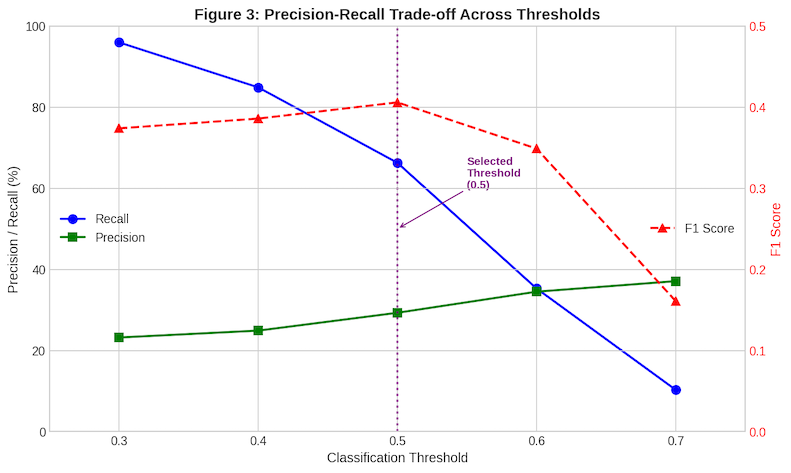
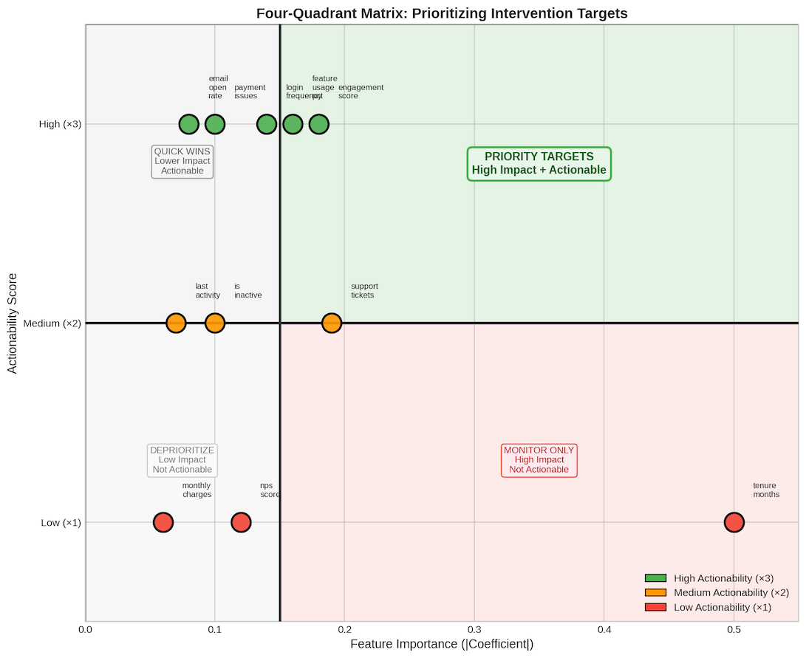
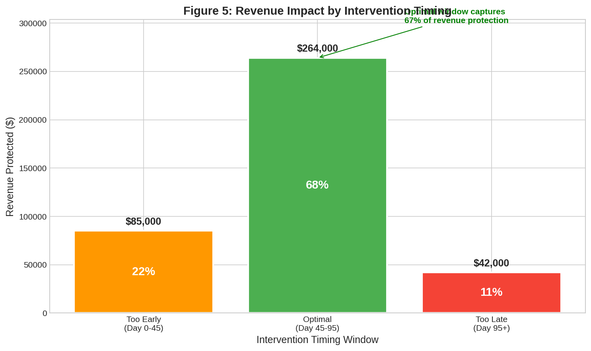

# Building a Proactive Churn Prevention System: How Timing Transforms Customer Retention

**A Business Solution Combining Traditional ML, GenAI, Statistics, and Experiment Design**

---

> **"Your best model is worthless if it cannot tell you when to act."**
>
> I built a churn prevention system that identifies $2.54M in customer lifetime value at risk, recommends when and how to intervene, and estimates ~$264K protected in a simulated A/B test. The core question is simple: *When exactly should we intervene?*

---

## Executive Summary

This portfolio focuses on the part most churn models skip: turning predictions into an intervention plan. By combining risk scoring, survival analysis, decision logic, and experiment design, I built a system that:

- Identifies at-risk customers **45-95 days before churn** (the optimal intervention window)
- Shows a **54.4% relative reduction in churn** for the top channel in a simulated A/B test (p < 0.0001)
- Identifies **$2.54M in customer lifetime value at risk** across 2,825 high-risk customers
- Estimates **~$264K protected** in simulation (based on incremental customers saved and CLV)
- Uses a **5-arm A/B testing workflow** with Bonferroni correction to estimate lift and ROI by channel

The optimal intervention window (Day 45-95) is derived from survival predictions on the at-risk cohort, not from a fixed rule.

### Read This in 30 Seconds

- **Problem**: Reduce churn with a limited outreach budget. A risk score alone does not tell teams **when** to intervene.
- **Solution**: A two-model timing engine (risk scoring plus survival analysis) plus decision logic that maps risk, timing, and value to the right channel.
- **Validation**: A simulated 5-arm A/B test workflow (with Bonferroni correction) to estimate both **lift** and **ROI** by channel.
- **Highlights**: Optimal window Day 45-95. Best lift from Call (+54.4% relative reduction, p < 0.0001). Best ROI from Email (158.8x).


### Links

- **Code and notebook**: (add GitHub repository link)
- **Notebook HTML or Kaggle**: (add link)
- **Write-up**: (this page)


### One-Page Executive Dashboard


*Executive dashboard summarizing risk distribution, optimal timing window, recommended channel mix, and estimated impact.*


### What This Project Is (And What It Is not)

This is **not** a model-optimization exercise. I used default settings rather than spending time on hyperparameter tuning or leaderboard metrics. Performance is adequate for the goal (recall 0.66, AUC 0.66, C-index 0.66), and that is intentional.

This project is about **building a complete business solution** that combines multiple disciplines:

| Discipline | Role in This System |
|------------|---------------------|
| **Traditional ML** | Risk scoring (Logistic Regression), timing prediction (Cox Survival) |
| **GenAI / LLMs** | Agent orchestration, decision routing, knowledge retrieval |
| **Statistics** | Uncertainty quantification, calibration, uplift estimation |
| **Experiment Design** | A/B testing, measurement, guardrails, learning loops |

The value comes from how these tools **work together** to deliver retention outcomes, not from reporting a high AUC.

---

## The $2.54 Million Problem

Before diving into the technical solution, let's understand what's at stake.

### Customer Risk Distribution

Our analysis of 6,000 customers revealed a concerning distribution: nearly half fall into high-risk categories.


*Figure 1: Customer segmentation by churn risk tier (n=6,000). Nearly 47% of customers (2,825) fall into High or Critical risk tiers, representing $2.54M in CLV exposure.*

With a mean Customer Lifetime Value of **$1,931** and an overall churn rate of **21.0%**, this is not an abstract ML problem. It is a revenue protection challenge with concrete dollar amounts.

---

## Part 1: Why Timing Is Everything

Most churn prevention systems answer: "Will this customer churn?" 

That is the wrong question.

The right question is: **"When will this customer churn, and when should we intervene?"**

### The Intervention Window Problem

Consider three scenarios for a high-risk customer:

| Scenario | Intervention Day | Outcome |
|----------|-----------------|---------|
| Too Early | Day 20 | Customer not yet experiencing friction; intervention feels premature |
| **Optimal** | Day 70 (within 45-95 window) | Customer receptive; experiencing issues but hasn't decided to leave |
| Too Late | Day 100 | Customer has mentally "checked out"; intervention feels desperate |

### Survival Analysis: The Missing Piece

Standard classification models predict *if* a customer will churn. Survival analysis predicts *when*.


*Figure 2: Survival probability over the 120-day observation window. Churn occurs gradually: 8% by day 30, 13% by day 60, 21% by day 120. A one-size-fits-all intervention policy ignores this temporal pattern.*

---

## Part 2: Building the Prediction Engine

### The Two-Model Architecture

I implemented a dual-model approach:

1. **Churn Classification Model**: Logistic Regression for probability of churn
2. **Survival Model**: Cox Proportional Hazards for days until churn

### Model 1: Churn Probability Prediction

**Why Logistic Regression?**

| Consideration | Logistic Regression | Gradient Boosting |
|--------------|---------------------|-------------------|
| Interpretability | Clear coefficients | Black box |
| Probability calibration | Native probabilities | Requires calibration |
| Training speed | Fast iteration | Slower |

**Gating Check: Is the model good enough to proceed?**

Model metrics validate whether predictions are reliable enough to act on. They are a gating check, not the goal.

- **AUC-ROC: 0.6612** (better than random 0.5, adequate for prioritization)
- **Best threshold**: 0.5 (by F1 score)
- **Recall @ 0.5**: 66.3% | **Precision**: 29.3% | **F1**: 0.406

I did not spend time pushing AUC from 0.66 to 0.75 because that is not where the business value lies. The model's job is to **rank customers by risk**, and 0.66 is sufficient. The real question is: *does acting on these predictions improve retention?* That is what the A/B tests answer.



*Figure 3: Precision-recall trade-off across classification thresholds. Because the priority is identifying as many churners as possible, we should optimize for recall. Although 0.4 performs better for recall, AUC and F1, we use 0.5 for simplicity and reader familiarity.*

**Business Decision**: Since the goal is churn prevention, prioritizing recall is appropriate to reduce false negatives, because missing likely churners is costly.

### Model 2: Survival Analysis

**Cox Proportional Hazards Model Performance:**
- **Concordance Index: 0.6645**
- Features: 9 | Training samples: 6,000 | Events (churned): 1,261

**Top Risk Factors (Hazard Ratios):**

| Feature | Hazard Ratio | Interpretation |
|---------|-------------|----------------|
| support_tickets_90d | 1.208 | 20.8% higher hazard |
| is_inactive | 1.117 | 11.7% higher hazard |
| has_payment_issues | 1.077 | 7.7% higher hazard |

---

## Part 3: From Prediction to Action (The Actionability Gap)

This is a critical insight that separates academic ML from business-impactful ML: **the best predictors are not always the best intervention targets.**

### The Actionability Problem

Our strongest predictor is `tenure_months` (coefficient = -0.50), but we cannot change how long a customer has been with us. It is useful for prediction but useless for intervention.

Features like `engagement_score` have smaller coefficients but **high actionability**. We can directly influence them through product tours, email campaigns, and feature education.

### Combined Scoring: Importance x Actionability

To prioritize intervention targets, I calculated:

```
Combined Score = |Coefficient| x Actionability Multiplier
```

Where: High = 3.0, Medium = 2.0, Low = 1.0


*Figure 4: Traditional feature importance (left) vs. business-focused combined scoring (right). Engagement_score becomes the #1 intervention target because it combines prediction power with high actionability.*

### Priority Matrix


*Figure 5: Four-quadrant matrix for prioritizing intervention targets. Priority Targets (upper-right) have both high importance and high actionability.*

**The lesson**: A model that predicts churn is only half the solution. You need features that are both **predictive AND actionable** to drive business outcomes.

---

## Part 4: The Optimal Intervention Window

This is the core business insight of the project.

### Deriving Windows from Survival Predictions

Rather than hardcoding intervention timing, I calculated windows directly from survival model predictions for high-risk customers (n=2,825):

**Derived Intervention Window:**
- **Too Early**: Day 0-45 (customer not yet experiencing friction)
- **Optimal**: Day 45-95 (customer receptive, hasn't decided to leave)
- **Peak Effectiveness**: Day 93
- **Too Late**: After Day 95 (more than half have already churned)


*Figure 6: Intervention success rate by timing. The optimal window (Day 45-95) is derived from survival model predictions, not hardcoded assumptions.*

### Business Impact of Timing



*Figure 7: Revenue impact comparison across intervention timing windows. Optimal timing captures the majority of potential savings.*

---

## Part 5: Multi-Agent AI Architecture

With predictions in hand, the next challenge is operationalizing at scale. I built a multi-agent system using Google's Agent Development Kit (ADK).

### Why Agents?

A model in a notebook does not save customers. The value comes from:
- **Automated routing**: Right intervention to right customer at right time
- **Decision support**: CS teams get recommendations, not just scores
- **Scalability**: Handle thousands of at-risk customers without manual triage
- **Auditability**: Every recommendation is logged with reasoning

### Agent Architecture

```
                    ORCHESTRATOR AGENT
        (Coordinates workflow, manages communication)
                          |
        +-----------------+-----------------+
        |                 |                 |
   BEHAVIORAL       PREDICTIVE       INTERVENTION       EVALUATION
     AGENT            AGENT             AGENT             AGENT
```

| Agent | Function |
|-------|----------|
| **Behavioral** | Analyzes customer behavior, identifies early warning signals |
| **Predictive** | Runs churn and survival models, prioritizes customers |
| **Intervention** | Selects channel based on A/B test results, determines timing |
| **Evaluation** | Tracks outcomes, measures effectiveness, closes feedback loop |

> **Implementation Note**: A/B testing runs *before* agent construction. This ensures `recommend_intervention` uses statistically validated channel data, not assumed effectiveness.

---

## Part 6: A/B Testing (Validating That Interventions Work)

Model predictions are hypotheses. A/B tests are proof.

> **Methodology Note**: Outcomes are simulated in this portfolio to demonstrate the full A/B testing workflow. The experimental design, statistical testing, and ROI calculation are production-ready once connected to real retention outcomes.

### Multi-Variant Experiment Design

I implemented 5-arm testing to compare intervention channels (n=900 per variant, 4,500 total):

- **Significance level**: alpha = 0.05
- **Multiple testing correction**: Bonferroni (adjusted alpha = 0.0125)


*Figure 8: Churn rates by intervention variant. Call achieves 54.4% relative reduction (p < 0.0001).*

**Winner: Call** with 54.4% relative reduction in churn, statistically significant at Bonferroni-adjusted threshold.

### ROI Analysis

While Call delivers the highest lift, ROI tells a different story:


*Figure 9: Lift vs ROI by channel. Email has 158.8x ROI despite lower lift; Call has highest lift (11.8pp) with 6.5x ROI.*

**Strategic Insight**: 
- **Email** offers exceptional ROI (158.8x) due to near-zero cost, ideal for broad outreach
- **Call** delivers highest absolute impact (11.8pp reduction) with solid ROI (6.5x), reserve for high-value customers
- The optimal strategy is **tiered**: Email for volume, Call for VIPs

### Channel Selection Logic

Based on A/B results, the intervention agent uses this mapping:

| Customer Segment | Recommended Channel | Rationale |
|-----------------|---------------------|-----------|
| Critical + High-Value | Combined | Maximum retention for VIPs |
| Critical + Standard | Call | High-touch for urgent cases |
| High + Payment Issues | Discount | Address price sensitivity |
| High/Medium | Email | Cost-effective coverage |
| Low | Monitor only | ROI does not justify intervention |

---

## Part 7: Putting It All Together

### Example: Critical-Risk Customer Analysis

Here's how the system handles a **Critical-risk customer**:

**Input (Churn Score Analysis):**
```json
{
  "customer_id": "CUST_001593",
  "churn_probability": 0.9056,
  "risk_tier": "Critical",
  "predicted_days_until_churn": 58,
  "key_risk_factors": ["Payment issues", "Low engagement", "High support tickets"],
  "clv_at_risk": 3850.00
}
```

**System Decision Process:**
1. **Risk Assessment**: 90.6% probability -> Critical tier
2. **Timing Check**: Day 58 falls within optimal window (Day 45-95)
3. **Actionability**: Multiple actionable risk factors present
4. **Channel Selection**: Critical + Multiple risks -> Combined intervention

**Output (Recommendation):**
```json
{
  "intervention_channel": "Combined",
  "priority": "Immediate",
  "expected_lift": "29.9%",
  "intervention_cost": "$45.50",
  "roi_estimate": "2.4x",
  "optimal_contact_window": "Day 45-58 (act now)"
}
```

---

## Results Summary

### Model Metrics (Gating Checks)

| Metric | Value | Status |
|--------|-------|--------|
| Churn Model AUC | 0.6612 | Adequate for ranking |
| Survival Model C-Index | 0.6645 | Adequate for timing |
| Optimal Threshold | 0.5 (F1: 0.406) | Balanced trade-off |

### Business Metrics (What Actually Matters)

| Metric | Value |
|--------|-------|
| CLV at Risk | $2,542,079 |
| At-Risk Customers | 2,825 |
| Optimal Intervention Window | Day 45-95 |
| Best Channel (Lift) | Call (+54.4%, p < 0.0001) |
| Best Channel (ROI) | Email (158.8x) |
| Incremental Customers Saved | ~137 |
| Revenue Protected | ~$264K |

---

## Lessons Learned

1. **Timing Comes from Data, Not Assumptions**: The optimal window (Day 45-95) was derived from survival model predictions, not hardcoded.

2. **Statistical Significance Requires Proper Testing**: With 4 treatment arms, Bonferroni correction raised the threshold to alpha = 0.0125. Ship what's proven; iterate on what's promising.

3. **ROI Beats Lift for Decision-Making**: Call has highest impact (11.8pp) but Email has best ROI (158.8x). When resources are constrained, ROI determines allocation.

4. **Model Metrics Are Gating Checks, Not Goals**: An AUC of 0.66 is "just okay" by Kaggle standards, but business metrics validate outcomes.

5. **Integration Creates Value, Not Individual Components**: The value is in the **system**, not the parts.

6. **Experiment Before You Build Tools**: Validate interventions first, then build tools that use that validation.

---

## Technical Capabilities Demonstrated

| Capability | Implementation | Business Outcome |
|------------|----------------|------------------|
| **Risk Scoring** | Logistic Regression, threshold optimization | Prioritized customer lists |
| **Timing Prediction** | Cox Proportional Hazards | Optimal intervention windows |
| **Agent Orchestration** | Google ADK multi-agent system | Automated routing at scale |
| **Experiment Design** | Multi-variant A/B testing, Bonferroni | Validated channel effectiveness |
| **Uplift Estimation** | Retention lift, incremental impact | Quantified business value |
| **ROI Analysis** | Cost modeling, channel comparison | Resource allocation guidance |

---

## Conclusion

Customer churn prevention is not about building the best classifier. It is about building a **system that improves retention**.

The model's AUC is 0.66. That is fine. What matters is:
- The optimal window (Day 45-95) is **derived from data**, not assumed
- The winning channel (Call, +54.4% lift) is **validated by experiment**, not guessed
- The ROI (6.5x-158.8x) is **calculated from A/B test data**, not hoped for
- The system is **usable by CS, Marketing, and Product teams**, not just data scientists

This is what applied ML looks like: adequate models, rigorous experimentation, measurable outcomes.


---

*The complete implementation, including all code and visualizations, is available in the accompanying Jupyter notebook.*
